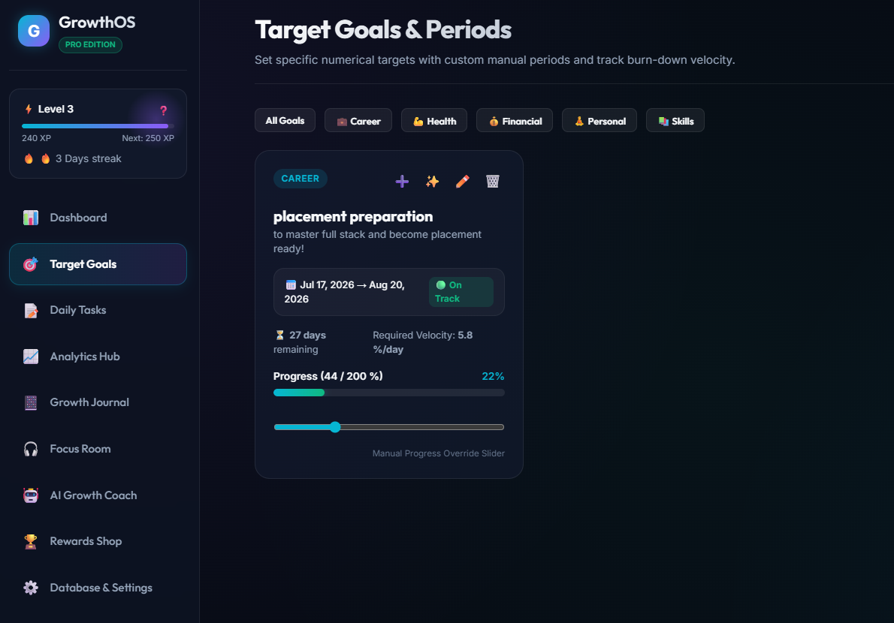
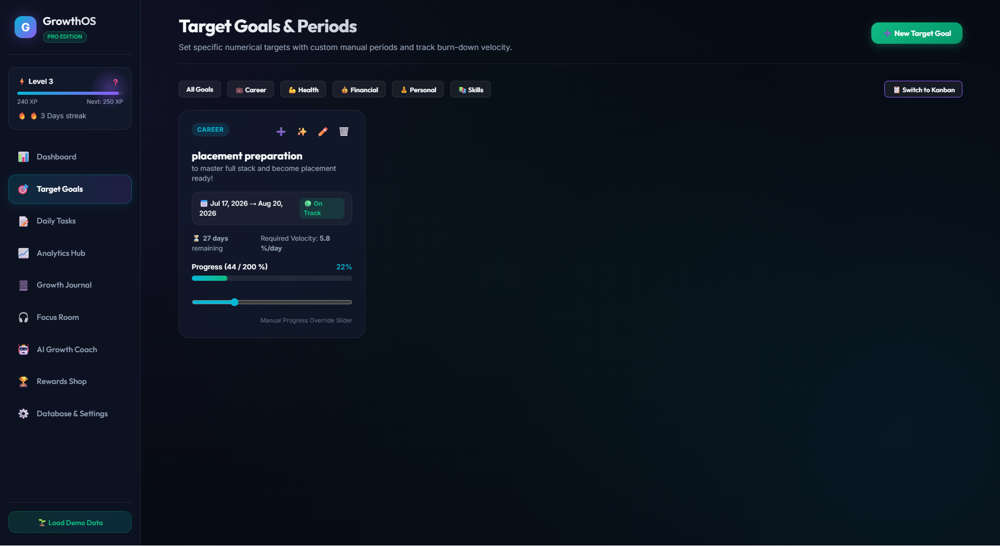
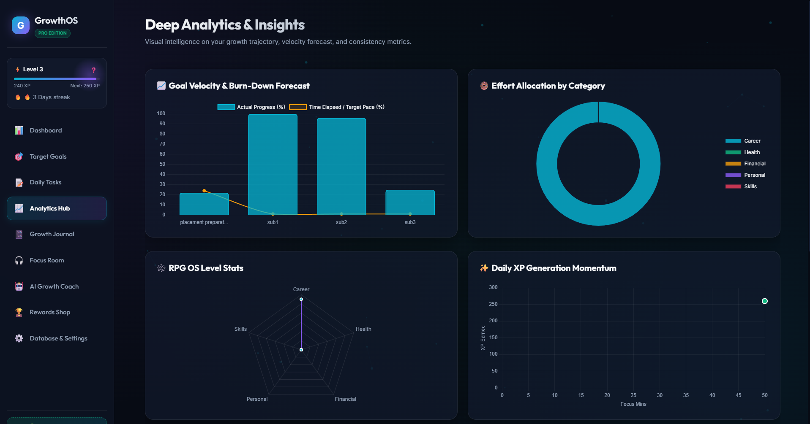
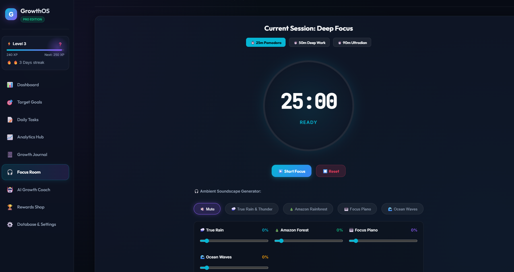

<div align="center">
  <h1 style="font-size: 3rem; margin-bottom: 0;">🎯 GrowthOS 🚀</h1>
  <p><strong>The Ultimate Gamified Productivity & Personal Growth Engine</strong></p>

  <p>
    <a href="#-core-features">Features</a> •
    <a href="#-ai-growth-coach">AI Coach</a> •
    <a href="#-tech-stack">Tech Stack</a> •
    <a href="#-getting-started">Getting Started</a>
  </p>
</div>

---

> **The Ultimate Gamified Productivity & Personal Growth Engine**

### 📸 Showcase
<div align="center">
  
  
  <br>
  
  
</div>

---

GrowthOS is a gamified, all-in-one productivity and personal growth dashboard designed to help you stay focused, build habits, and level up your life like an RPG. Built with a modern tech stack and designed for a seamless, distraction-free experience, GrowthOS combines hierarchical task management, AI coaching, journaling, and ambient focus rooms into one beautiful, glassmorphic interface.

## ✨ Core Features

### 🎮 Gamified Productivity
- **Experience Points (XP) & Leveling:** Earn XP by completing tasks and checking in daily. Watch your level grow as you consistently hit your goals!
- **Daily Streaks:** Check in every day to maintain and grow your streak. Consistency is rewarded!
- **Rewards Shop:** Spend your hard-earned XP to redeem custom real-life rewards (e.g., "Watch a movie", "Cheat Meal") to incentivize your hard work.

### 🎯 Hierarchical Target Goals & Task Management
- **Goal Tree Explorer:** Create overarching target goals with precise numerical targets (e.g., "Save $5000").
- **Infinite Sub-Tasks:** Break down massive goals into manageable daily tasks. Tasks can have infinitely nested sub-tasks, and completing all sub-tasks automatically rolls up and completes the parent!
- **Burn-Down Velocity Metrics:** The engine calculates your required daily velocity to hit your goal deadlines on time.

### 🤖 AI Growth Coach (Hybrid Engine)
- **Actionable Advice:** The AI Coach analyzes your goals and streaks, and generates **[➕ Add Task]** buttons directly in the chat to seamlessly insert habits into your day.
- **LLM Integrations:** Plug in your Groq, OpenAI, or Gemini API keys to unlock advanced hyper-personalized executive strategies.
- **Smart Local Heuristics:** Even without an API key, the local offline heuristic engine analyzes your velocity deficits and protects your streaks.

### 🎧 Ambient Focus Room (Pomodoro)
- **Deep Work Timer:** A built-in Pomodoro timer with customizable presets (25m, 50m, custom).
- **20-20-20 Eye Strain Rule:** Automatically alerts you every 20 minutes to look 20 feet away for 20 seconds.
- **Multi-Track Audio Mixer:** Mix and match high-quality ambient sounds (Rain, Nature, Piano, Ocean) to create your perfect focus environment.

### 📓 Daily Journaling & Analytics
- **Mood Tracking & Reflection:** Log your daily mood and journal entries to correlate energy levels with productivity.
- **Analytics Dashboard:** Visualize your category distribution, streak heatmap, and daily velocity through interactive `Chart.js` graphs.

---

## 🛠️ Tech Stack
- **Frontend:** Vanilla HTML5, CSS3 (Custom Glassmorphism Design), JavaScript (ES6+). No heavy frameworks, purely optimized for absolute speed and performance.
- **Database:** IndexedDB local browser storage (Private, secure, and lightning fast).
- **Data Portability:** 1-Click JSON Import/Export architecture to backup or migrate your operating system.

---

## 🚀 Getting Started

1. **Clone the repository:**
   ```bash
   git clone https://github.com/harilight/GrowthAI.git
   ```
2. **Launch the App:**
   Simply open `index.html` in any modern web browser (Chrome, Edge, Firefox, Safari). No build tools or package installations required!
3. **Configure AI (Optional):**
   Navigate to the **AI Growth Coach** tab, click **Configure AI API Key**, and enter your preferred API key (Groq, OpenAI, or Gemini) to unlock the LLM Executive Coach.

---
*Built to help you conquer your goals and track your growth, one level at a time.*
